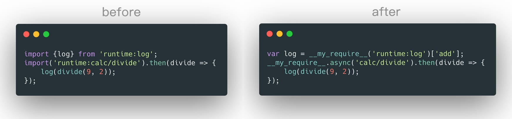

# babel-plugin-import-customized-require

## Intro

It's a babel plugin to transform the ESM (`import`) syntax to your own call expression (e.g. `__my_require__()`) , in order to passby webpack's compiling. As a result, you can intergrate it (e.g. `__my_require__()`) into your own module loaders.



## Usage

```bash
git clone git@github.com:alienzhou/babel-plugin-import-customized-require.git

mv babel-plugin-import-customized-require $your_project
```

It's a standard babel plugin. You can use it in babel-loader with webpack.

```javascript
// webpack.config.js

const customRequire = require('./babel-plugin-import-customized-require');


module.exports = {
    entry: {
        // ...
    },
    output: {
        // ...
    },
    module: {
        rules: [{
            test: /\.js|jsx$/,
            use: {
                loader: 'babel-loader',
                options: {
                    plugins: [
                        'syntax-dynamic-import',
                        customRequire
                    ]
                }
            }
        }]
    },
    // ...
}
```

## Output

Then, source code (as below)

```javascript
import main from 'runtime:main';
import * as util from 'runtime:util';
import {add} from 'runtime:calc';
import {Nav as Mynav, Banner} from 'runtime:common/component';
import 'runtime:common/reset';

import('runtime:calc/divide').then(divide => {
    alert(divide(3, 2));
});
```

will be transformed to (webpack bundles output)

```javascript
var main = __my_require__('main')['default'];
var util = __my_require__('util');
var add = __my_require__('calc')['add'];
var Mynav = __my_require__('common/component')['Nav'];
var Banner = __my_require__('common/component')['Banner'];
__my_require__('common/reset');

__my_require__.async('calc/divide').then(divide => {
    alert(divide(3, 2));
});
```
